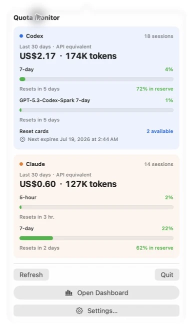

<div align="center">
  <a href="https://quota-monitor.timmyagentic.com/">
    
  </a>

  <h1>Quota Monitor</h1>

  <p><strong>Know your quota. Keep your flow.</strong></p>

  <p>
    A native macOS menu-bar app for Codex and Claude Code quotas, token usage,<br>
    API-equivalent cost estimates, trends, and session-level insights.
  </p>

  <p>
    <a href="https://quota-monitor.timmyagentic.com/">Website</a> ·
    <a href="https://quota-monitor.timmyagentic.com/download">Download</a> ·
    <a href="https://github.com/timmyagentic/quota-monitor/releases/latest">Releases</a> ·
    <a href="https://quota-monitor.timmyagentic.com/privacy">Privacy</a> ·
    English · <a href="README.zh-CN.md">简体中文</a>
  </p>

  <p>
    <a href="https://github.com/timmyagentic/quota-monitor/releases/latest"></a>
    <a href="https://github.com/timmyagentic/quota-monitor/releases"></a>
    <a href="https://www.npmjs.com/package/quotamonitor"></a>
    
    
    <a href="LICENSE"></a>
  </p>
</div>

## Install with an AI agent

Paste this into Codex, Claude Code, Cursor, or another local coding agent:

> Install the latest official Quota Monitor release on this Mac. Follow
> <https://raw.githubusercontent.com/timmyagentic/quota-monitor/main/docs/agent-install.md>
> exactly. Do not use sudo or change shell configuration. Ask before replacing
> an existing app. At the end, report the installed version, path, Developer ID,
> and Gatekeeper result.

Prefer the terminal? One command installs and opens the verified app:

```bash
npx --yes quotamonitor@latest install
```

Requires macOS 14 or later on Apple Silicon and Node.js 20.17 or later.

<a href="https://quota-monitor.timmyagentic.com/">
  
</a>

## Why Quota Monitor

Codex and Claude Code expose quota and usage information in different places.
Quota Monitor brings those signals together in a lightweight native Mac app,
so three everyday questions take seconds to answer:

- How much quota is left, and when does it reset?
- Where are tokens and API-equivalent costs going?
- Which days, models, and sessions account for the most usage?

Use the menu-bar popover for a quick check, then open the full Dashboard when
you want to investigate further.

## Start in the menu bar

<p align="center">
  <a href="website/public/assets/menu-bar-popover.webp">
    
  </a>
</p>

Quota Monitor has two everyday layers before you ever open the Dashboard:

- **Always-visible readout — `7d 4%`.** The status item shows only the quota
  windows that each provider currently exposes, using either the percentage
  consumed or the percentage remaining. If Codex currently exposes only a
  weekly window, Quota Monitor shows only `7d 4%`; it does not splice in a
  stale 5-hour value. Choose Codex, Claude Code, both side by side, or only the
  gauge icon in Settings.
- **Click-to-open popover.** Each provider block combines the selected 7- or
  30-day token total, API-equivalent cost estimate, and session count with live
  quota rows, reset countdowns, pace or reserve guidance, model-specific
  limits, and Codex reset cards. Refresh in place, or continue to Dashboard and
  Settings from the same panel.

The dollar figures are API-list-price equivalents for the displayed tokens,
not subscription charges or provider invoices. The screenshot above uses only
isolated synthetic data.

## Highlights

- **Live quota clarity** — see Codex and Claude Code quota windows, usage
  percentages, reset times, availability, and burn-rate projections.
- **One-click menu-bar overview** — keep each provider's currently available
  5-hour or 7-day percentage visible without leaving your current workflow.
- **Trends and forecasts** — compare recent periods, inspect activity over
  time, and understand which providers and models dominate usage.
- **Session-level detail** — search and sort sessions, then inspect models,
  events, token categories, timing, and estimated value.
- **Local history** — index known Codex and Claude Code history folders into a
  local SQLite database for fast daily and session-level exploration.
- **Native Mac experience** — SwiftUI, English and Simplified Chinese,
  Developer ID signing, Apple notarization, and Sparkle updates.

| Dashboard | Sessions | History |
| --- | --- | --- |
|  |  |  |

## Install

Quota Monitor requires **macOS 14 Sonoma or later on Apple Silicon**.

### npm (recommended)

With Node.js 20.17 or later already installed:

```bash
npx --yes quotamonitor@latest install
```

This explicit command has no `postinstall` hook. It downloads the newest
compatible version delivered through Quota Monitor's official Appcast, then
checks the GitHub Release URL and length, SHA-256, Sparkle Ed25519 signature,
Developer ID Team ID, and Apple Gatekeeper assessment before copying the app.
It never uses `sudo` or reads Codex, Claude Code, or Quota Monitor user data.

An existing current version is verified in place. To replace an older copy,
quit Quota Monitor and rerun with `--replace` after confirming the path shown by
the installer. Installed copies receive later app releases through the built-in
Sparkle updater.

### DMG

1. [Download the latest notarized DMG](https://quota-monitor.timmyagentic.com/download).
2. Open the DMG and drag **Quota Monitor** into **Applications**.
3. Launch the app and choose Codex, Claude Code, or both during setup.

Specific versions and checksums are available on
[GitHub Releases](https://github.com/timmyagentic/quota-monitor/releases).
Release builds are Developer ID signed and Apple notarized.

Optional checksum verification:

```bash
cd ~/Downloads
shasum -c QuotaMonitor-<version>.dmg.sha256
```

<details>
<summary>Upgrading from CodexMonitor</summary>

Quota Monitor was renamed from CodexMonitor on 2026-05-07. The current bundle
identifier is `dev.tjzhou.QuotaMonitor`. First launch automatically migrates
the legacy database and preferences; the old
`/Applications/CodexMonitor.app` copy can then be removed manually.

</details>

## How it works

| Provider | Live quota source | Local usage history |
| --- | --- | --- |
| Codex | `codex app-server` with `account/rateLimits/read` and on-demand `account/usage/read` | `~/.codex/sessions` and `~/.codex/archived_sessions` |
| Claude Code | Anthropic's OAuth usage endpoint with local Claude Code credentials | `~/.claude/projects` and `~/.config/claude/projects` |

Quota Monitor can use a standalone Codex or Claude Code CLI, the Codex binary
bundled in the unified first-party `ChatGPT.app` or legacy `Codex.app`, or
Claude Desktop's bundled Claude Code helper. It does not decrypt or reuse
Claude Desktop's separate Electron token cache.

API-equivalent costs are estimates derived from model pricing and token counts.
They are not provider invoices or subscription charges.

## Privacy

Session history and usage events stay in Quota Monitor's local SQLite database.
Live quota refreshes and the Codex Dashboard's on-demand Account activity view
contact the corresponding provider service. Account activity is read through
the local Codex app-server and is not written into local history.

Eligible Developer ID builds also send one anonymous daily active-installation
check-in containing exactly six fields: schema version, UTC day, app version,
brand, distribution channel, and a rotating daily token. It does **not** include
account details, quota values, usage history, file paths, a device ID, or any
stable identifier.

Read the complete bilingual
[privacy policy](https://quota-monitor.timmyagentic.com/privacy) for retention,
aggregation, and Cloudflare network-boundary details.

## Build from source

No Xcode project is required. The macOS app uses Swift Package Manager.

```bash
# Run tests without macOS keychain stalls
swift test --disable-keychain

# Run the repository's default non-GUI validation gate
./qa/run-static.sh

# Assemble and open a locally signed app bundle
./build.sh
open .build/QuotaMonitor.app

# Build with release settings
CONFIG=release ./build.sh
```

The official website is versioned in [`website/`](website/) alongside the app:

```bash
cd website
npm ci
npm run dev

# Validate the complete website surface
npm run check
```

For signing, notarization, packaging, and releases, see
[`docs/release.md`](docs/release.md).

## Repository map

```text
QuotaMonitor/
├── App/                 App lifecycle and shared state
├── Core/                Import, quota, analytics, storage, and settings logic
└── Features/            Menu bar, Dashboard, History, Sessions, and Settings UI
Tests/QuotaMonitorTests/ Swift Testing suites and fixtures
website/                 Official website, Worker APIs, D1 migrations, and tests
npm/quotamonitor/        Verified one-command installer and its tests
qa/                      Static checks and isolated macOS QA helpers
docs/                    Architecture, behavior, release, and product documentation
tools/                   Build, DMG, notarization, and release automation
```

Useful references:

- [Product manual](docs/product-manual.md)
- [AI-agent installation runbook](docs/agent-install.md)
- [Architecture notes](CLAUDE.md)
- [Codex and Claude integration findings](docs/findings.md)
- [Feature parity and design choices](docs/parity.md)
- [English changelog](CHANGELOG.md) ·
  [简体中文更新日志](CHANGELOG.zh-Hans.md)

## Contributing

Issues and pull requests are welcome. Keep changes focused, add tests for app
logic, update both changelogs for user-visible work, and run the relevant app
or website validation before opening a pull request.

## Acknowledgements

Quota Monitor began as a Swift rewrite of
[codex-pacer](https://github.com/RyanZhangNTU/codex-pacer). It also draws on
ideas from [ccusage](https://github.com/ryoppippi/ccusage), especially its
usage-analysis and pricing work.

## License

[MIT](LICENSE) © 2026 tjzhou.
