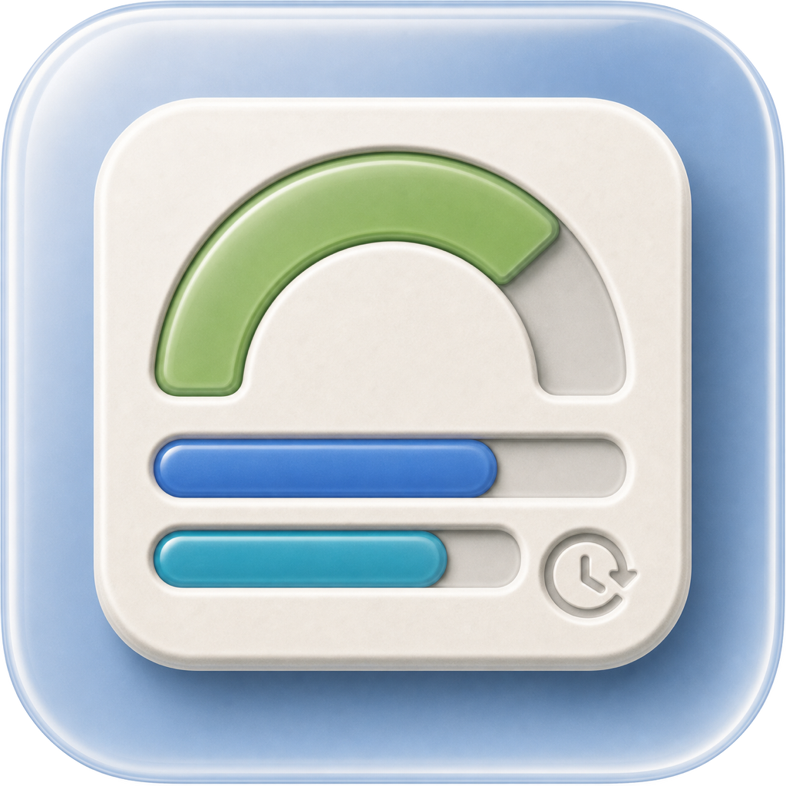
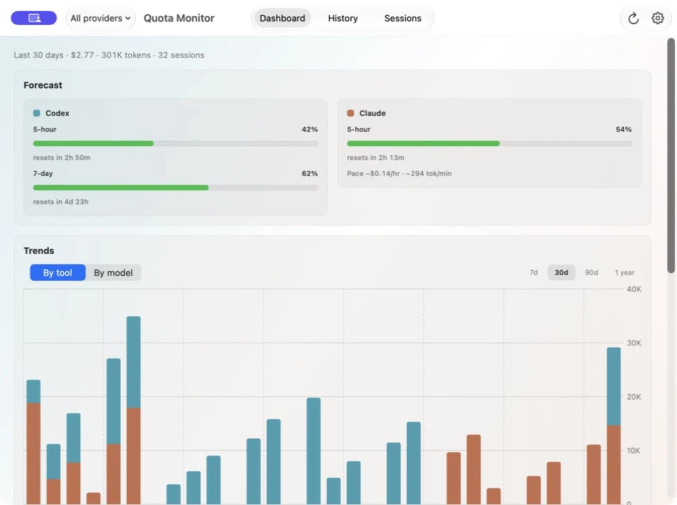
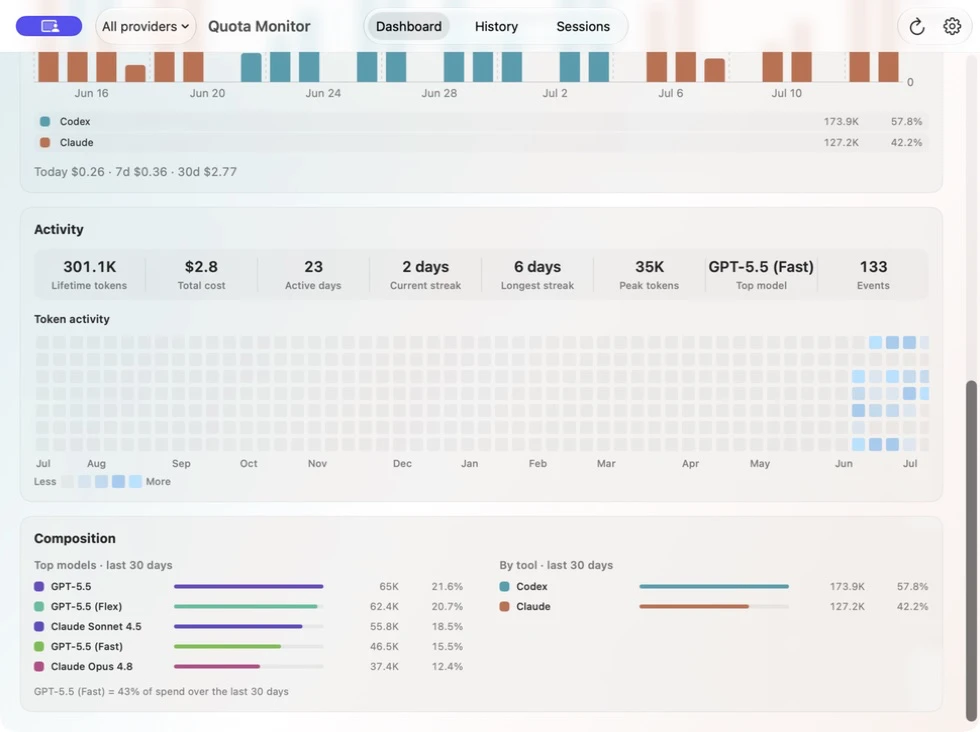
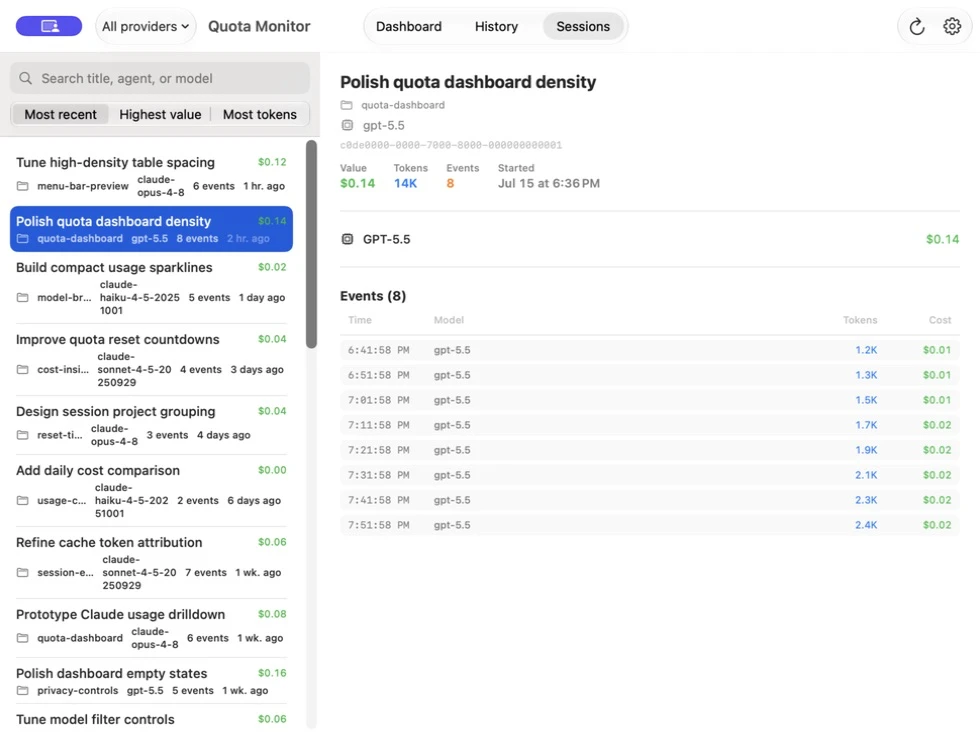
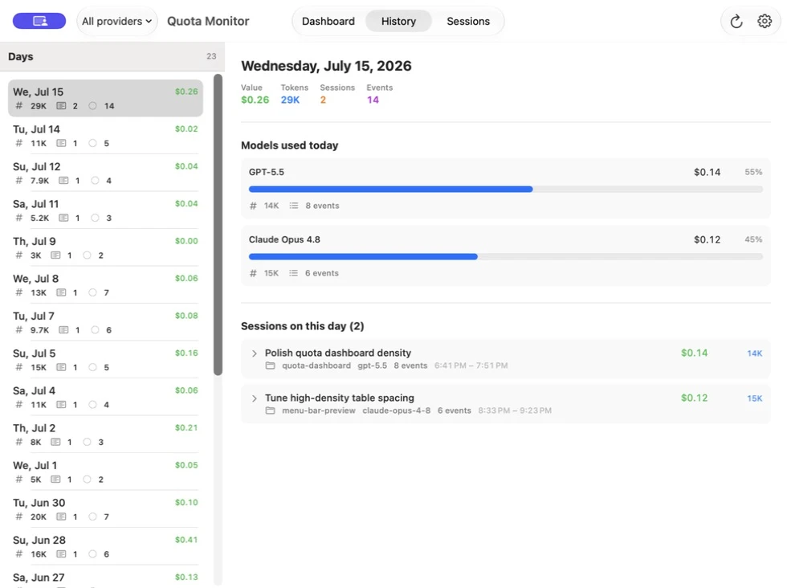

<div align="center">
  <a href="https://quota-monitor.timmyagentic.com/">
    
  </a>

  <h1>Quota Monitor</h1>

  <p><strong>看清额度，保持节奏。</strong></p>

  <p>
    原生 macOS 菜单栏工具，集中查看 Codex 与 Claude Code 的额度、Token 用量、<br>
    API 等价费用估算、趋势和会话级明细。
  </p>

  <p>
    <a href="https://quota-monitor.timmyagentic.com/">官网</a> ·
    <a href="https://quota-monitor.timmyagentic.com/download">下载</a> ·
    <a href="https://github.com/timmyagentic/quota-monitor/releases/latest">Releases</a> ·
    <a href="https://quota-monitor.timmyagentic.com/privacy">隐私</a> ·
    <a href="README.md">English</a> · 简体中文
  </p>

  <p>
    <a href="https://github.com/timmyagentic/quota-monitor/releases/latest"></a>
    <a href="https://github.com/timmyagentic/quota-monitor/releases"></a>
    
    
    <a href="LICENSE"></a>
  </p>
</div>

<a href="https://quota-monitor.timmyagentic.com/">
  
</a>

## 为什么选择 Quota Monitor

Codex 与 Claude Code 的额度和用量信息分散在不同位置。Quota Monitor
把这些信号集中到一个轻量的原生 Mac 应用里，让三个日常问题几秒就能得到答案：

- 还剩多少额度，什么时候重置？
- Token 和 API 等价费用主要花在哪里？
- 哪些日期、模型和会话贡献了最多用量？

平时从菜单栏弹窗快速查看，需要深入分析时再打开完整 Dashboard。

## 核心能力

- **实时额度一目了然** —— 查看 Codex 与 Claude Code 的额度周期、使用比例、
  重置时间、可用状态和消耗速度预测。
- **一点即开的菜单栏概览** —— 无需离开当前工作流，就能随时查看最重要的
  5 小时与 7 天数据。
- **趋势与预测** —— 对比近期周期、观察活跃变化，并了解主要用量来自哪些
  Provider 和模型。
- **会话级明细** —— 搜索、排序会话，并继续查看模型、事件、Token 分类、
  时间和估算价值。
- **本地历史分析** —— 把已知的 Codex 与 Claude Code 历史目录索引到本地
  SQLite 数据库，快速按日期和会话探索。
- **原生 Mac 体验** —— SwiftUI 界面、中英双语、Developer ID 签名、
  Apple 公证和 Sparkle 自动更新。

| Dashboard | Sessions | History |
| --- | --- | --- |
|  |  |  |

## 安装

Quota Monitor 需要 **macOS 14 Sonoma 或更高版本**。

1. [下载最新的已公证 DMG](https://quota-monitor.timmyagentic.com/download)。
2. 打开 DMG，把 **Quota Monitor** 拖入 **Applications（应用程序）**。
3. 启动应用，并在初始设置中选择 Codex、Claude Code 或两者都启用。

指定版本和校验和可在
[GitHub Releases](https://github.com/timmyagentic/quota-monitor/releases) 获取。
正式版本经过 Developer ID 签名和 Apple 公证；安装后可通过内置 Sparkle
更新器获取后续版本。

可选的校验和验证：

```bash
cd ~/Downloads
shasum -c QuotaMonitor-<version>.dmg.sha256
```

<details>
<summary>从 CodexMonitor 升级</summary>

CodexMonitor 已于 2026-05-07 更名为 Quota Monitor，当前 Bundle ID 为
`dev.tjzhou.QuotaMonitor`。首次启动会自动迁移旧数据库和偏好设置，之后可以
手动删除旧的 `/Applications/CodexMonitor.app`。

</details>

## 数据如何获取

| Provider | 实时额度来源 | 本地用量历史 |
| --- | --- | --- |
| Codex | `codex app-server` 与 `account/rateLimits/read` | `~/.codex/sessions` 与 `~/.codex/archived_sessions` |
| Claude Code | 使用本机 Claude Code 凭据访问 Anthropic OAuth 用量接口 | `~/.claude/projects` 与 `~/.config/claude/projects` |

Quota Monitor 可以使用独立安装的 Codex 或 Claude Code CLI，也可以发现第一方
`Codex.app` 内置的 Codex 二进制，以及 Claude Desktop 内置的 Claude Code
Helper。它不会解密或复用 Claude Desktop 独立的 Electron Token 缓存。

API 等价费用根据模型价格和 Token 数量估算，不代表 Provider 账单或订阅费用。

## 隐私

会话历史和用量事件保存在 Quota Monitor 的本地 SQLite 数据库中。只有刷新
实时额度时，应用才会访问相应的 Codex 或 Claude Code Provider 服务。

符合条件的 Developer ID 版本每天还会发送一次匿名活跃安装记录，内容严格
限定为六个字段：Schema 版本、UTC 日期、应用版本、品牌、分发渠道和每日轮换
Token。它**不包含**账号详情、额度数值、用量历史、文件路径、设备 ID 或任何
稳定标识。

完整的保留期限、聚合方式和 Cloudflare 网络边界说明，请阅读
[中英双语隐私政策](https://quota-monitor.timmyagentic.com/privacy)。

## 从源码构建

macOS 应用使用 Swift Package Manager，不需要 Xcode Project。

```bash
# 运行测试并避免 macOS Keychain 卡住
swift test --disable-keychain

# 运行仓库默认的非 GUI 校验
./qa/run-static.sh

# 组装并打开本地签名的应用
./build.sh
open .build/QuotaMonitor.app

# 使用 Release 配置构建
CONFIG=release ./build.sh
```

官网源码与应用一起保存在 [`website/`](website/)：

```bash
cd website
npm ci
npm run dev

# 校验完整官网
npm run check
```

签名、公证、打包和发布流程见 [`docs/release.md`](docs/release.md)。

## 仓库结构

```text
QuotaMonitor/
├── App/                 应用生命周期和共享状态
├── Core/                导入、额度、分析、存储和设置逻辑
└── Features/            菜单栏、Dashboard、History、Sessions 和 Settings UI
Tests/QuotaMonitorTests/ Swift Testing 测试与 Fixtures
website/                 官网、Worker API、D1 Migration 和测试
qa/                      静态检查与隔离的 macOS QA 工具
docs/                    架构、行为、发布与产品文档
tools/                   构建、DMG、公证与发布自动化
```

常用文档：

- [产品手册](docs/product-manual.md)
- [架构说明](CLAUDE.md)
- [Codex 与 Claude 集成发现](docs/findings.md)
- [功能对照与设计取舍](docs/parity.md)
- [English changelog](CHANGELOG.md) ·
  [简体中文更新日志](CHANGELOG.zh-Hans.md)

## 贡献

欢迎提交 Issue 和 Pull Request。请保持改动聚焦，为应用逻辑补充测试，更新中英
两份 Changelog，并在提交 PR 前运行相关的应用或官网校验。

## 致谢

Quota Monitor 最初是 [codex-pacer](https://github.com/RyanZhangNTU/codex-pacer)
的 Swift 重写，也参考了 [ccusage](https://github.com/ryoppippi/ccusage)
在用量分析和计价方面的思路。

## 许可证

[MIT](LICENSE) © 2026 tjzhou.
