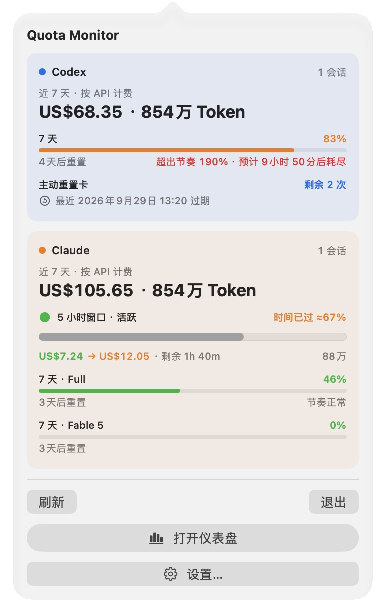
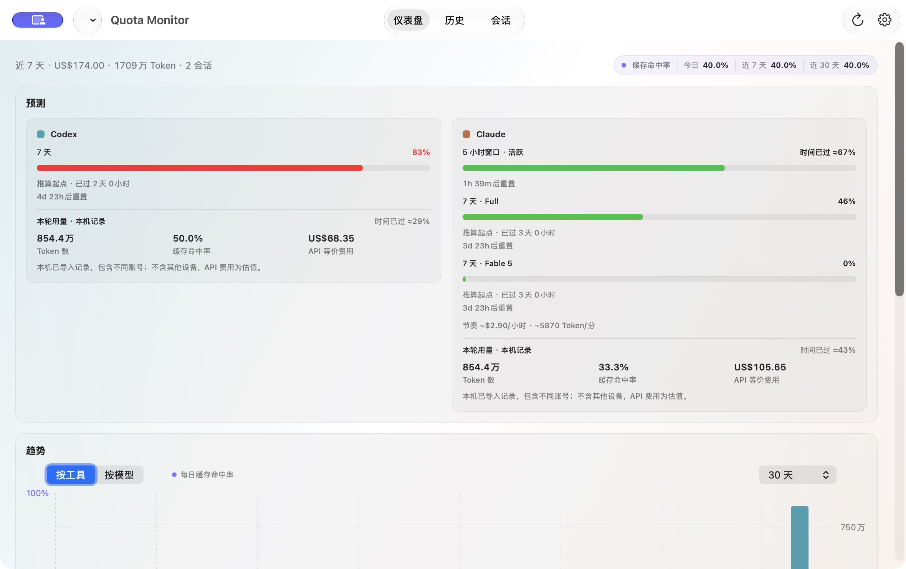

# Claude 五小时显示验证

源代码提交：`c69fc25`。截图来自该提交构建的原生 macOS App，使用隔离 HOME、UserDefaults 和合成数据；未调用 Codex/Claude 的真实额度接口。

复现条件：Claude 没有当前或保留的五小时额度，Full 周额度为 46%、Fable 5 周额度为 0%，同时存在本机五小时计费记录。旧菜单栏进入周额度分支后只显示“当前窗口空闲”，Dashboard 则回退到本机计费窗口。

修复后，两处共用五小时来源选择，均显示“5 小时窗口 · 活跃 / 时间已过 ≈67%”。真实五小时额度（包含 0%）及保留的过期额度仍优先于本机计费窗口；无任何五小时来源时保留空闲状态。本机进度明确标注为时间估计，不充当账号额度百分比。Codex 的仅周额度状态保持不补造五小时数据。

## 实际构建截图

### 菜单栏

### Dashboard

## 验证

- 提取旧菜单栏来源判断后，回归测试出现 3 个预期失败；修复后聚焦 24 项测试全部通过。
- `./qa/run-static.sh`：191 项工具测试、1061 项 Swift 测试（122 个 suite）及其他静态检查通过。
- Computer Use 在上述隔离原生 App 中读取菜单栏与 Dashboard，并用菜单栏快捷键打开 Dashboard；两处显示相同时间进度，周额度和零值模型额度保留，无可见裁切或重叠。
- 本机未使用 Claude Code 或真实凭据。真实账号网络返回、正式安装和发布：UNVERIFIED；不属于本次代码修复交付。

截图提交只补充验证材料，不改变 `c69fc25` 的实现。
