# Quota Monitor 产品说明

本说明面向普通用户，第一版基于 `0.2.31`、commit `508accc` 的真实 App 运行结果整理，并按本文末尾的更新记录持续补充。当前内容已覆盖 `0.2.41` 的更新提醒和匿名版本统计设置。

截图基线位于 `docs/assets/product-manual/508accc/`。

## Quota Monitor 是什么

Quota Monitor 是一个 macOS 菜单栏工具，用来查看 Codex 和 Claude Code 的用量、费用估算、额度状态和历史会话。它的价值是把分散在本机记录和额度接口里的信息集中到一个轻量窗口里，让你快速判断：

- 现在额度是否紧张。
- 最近 7 天或 30 天花了多少、用了多少 tokens。
- 哪些会话和模型贡献了主要用量。
- 哪个工具应该继续追踪，哪个可以关闭以减少无用刷新。

## 首次设置

首次启动时会出现设置向导。

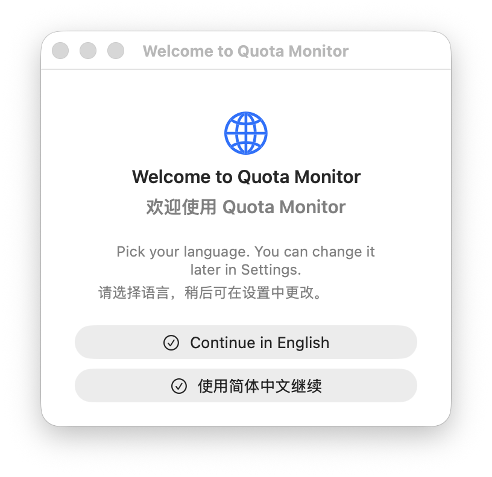

1. 在语言页选择 `Continue in English` 或 `使用简体中文继续`。选择后界面会立即切换语言，不需要重启。
2. 在工具页选择要追踪的工具。`Codex` 默认开启，`Claude Code` 默认关闭。至少要保留一个工具，才能继续。
3. 如果同时选择 Codex 和 Claude Code，下一步会让你选择哪些工具显示在菜单栏读数里。只选择一个工具时会跳过这一步。
4. 点击 `Continue` 后，App 会保存选择并开始扫描本机用量记录。

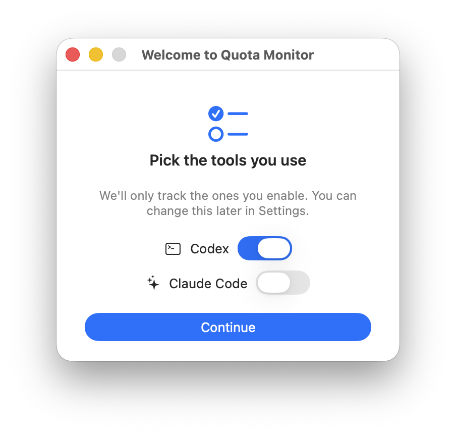

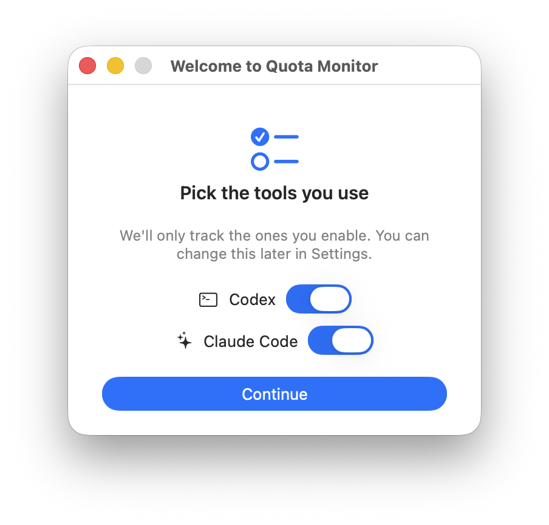

如果设置还没完成就打开菜单栏弹窗，弹窗会显示 `Setup not finished`，点击 `Open setup` 会回到设置向导。

## 菜单栏弹窗

菜单栏图标是 Quota Monitor 的日常入口。点击菜单栏读数或仪表图标，会打开弹窗。

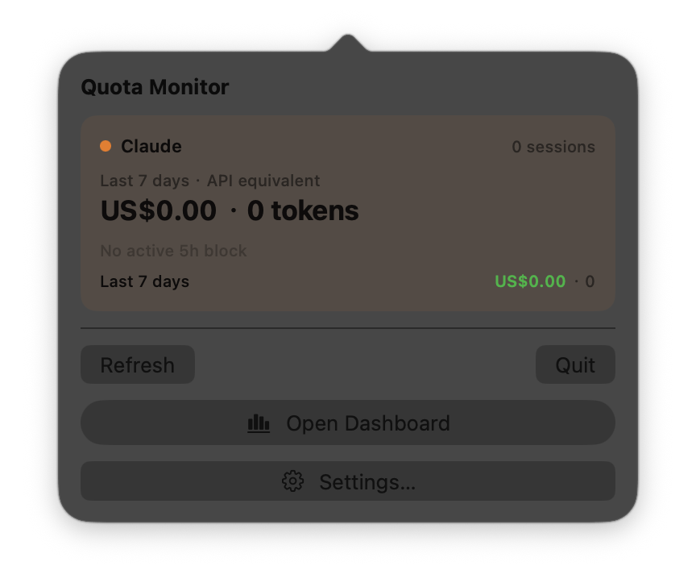

弹窗里每个已启用工具会显示一个区块：

- 顶部显示工具名、最近窗口的费用估算、tokens 和会话数。
- 配额行显示 5 小时、7 天等窗口的使用或剩余额度百分比。
- 绿色、橙色、红色分别表示宽松、接近紧张和高风险状态。
- Claude Code 如果没有可用 live quota，会显示本地估算和登录/凭据提示。

常用按钮：

- `Refresh`：重新扫描本机记录，并刷新可用的额度信息。刷新期间按钮会变成 `Refreshing...`。
- `Open Dashboard`：打开完整仪表盘窗口。
- `Settings...`：打开设置窗口。
- `Quit`：退出 Quota Monitor。

如果有尚未处理的新版本，弹窗标题栏会显示蓝色 `Update` 按钮；点击它会重新打开更新流程。macOS 菜单栏里的额度文字或仪表图标本身不会因为有更新而增加箭头或变色。

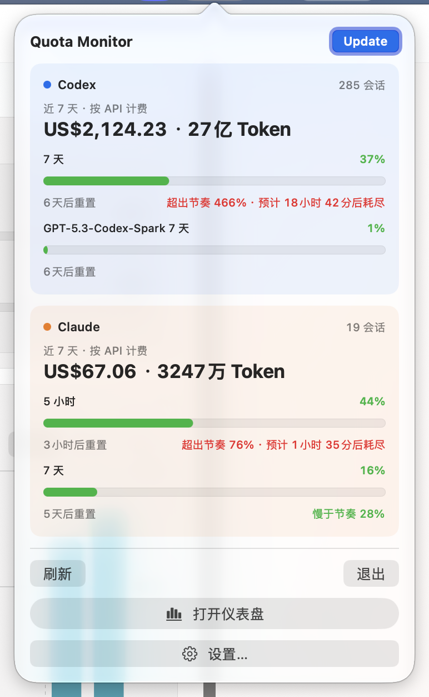

## Dashboard

Dashboard 用来快速判断整体趋势和额度风险。

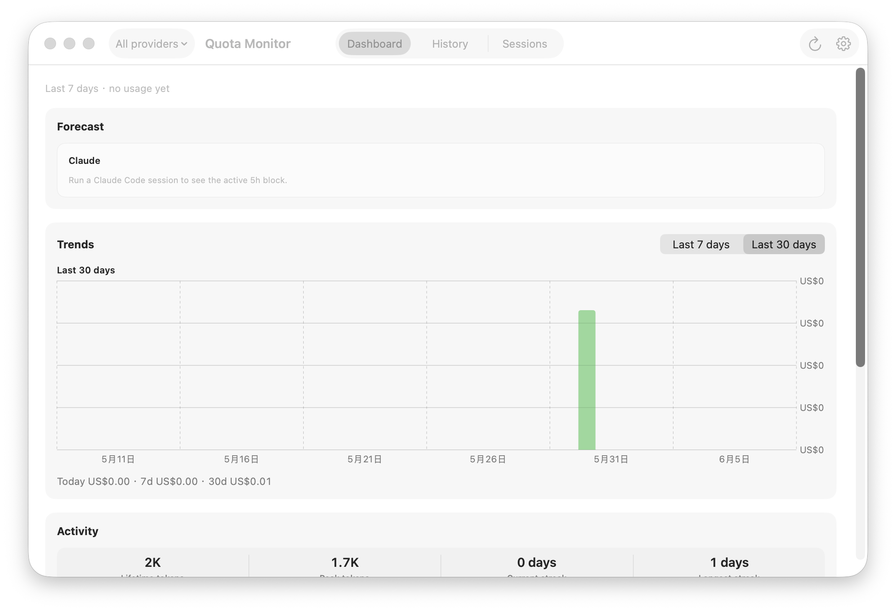

窗口顶部工具栏：

- `All providers` 菜单：选择全部工具，或只看某个工具。切换后 Dashboard、History、Sessions 会按选择重新加载。
- `Dashboard / History / Sessions`：在三个主页面之间切换。
- 刷新按钮：重新加载当前页面。当前在 History 或 Sessions 时，也会重新加载对应列表。
- 齿轮按钮：打开设置。

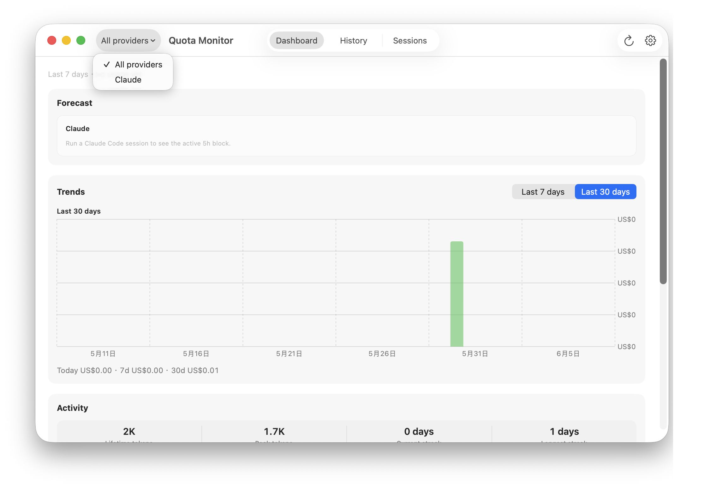

Dashboard 主要区域：

- `Forecast`：显示当前额度窗口是否可能提前耗尽。没有足够数据时会提示你先运行对应工具。
- `Trends`：显示最近 7 天或 30 天的使用趋势。点击 `Last 7 days` / `Last 30 days` 可以切换图表周期。
- `Activity`：显示累计 tokens、峰值 tokens、连续活跃天数等使用活跃度。
- `Composition`：显示最近 30 天模型或工具的费用占比，帮助判断主要消耗来自哪里。

Dashboard 保持最小化时不会反复执行图表刷新；从 Dock 或应用入口恢复窗口时，会立即加载最新的摘要和图表。

如果菜单栏图标被隐藏，Dashboard 顶部会出现提示。点击 `Show me how` 打开找回菜单栏图标的帮助窗口，点击 `Got it` 可关闭提示。

## History

History 用来按日期回看使用情况。

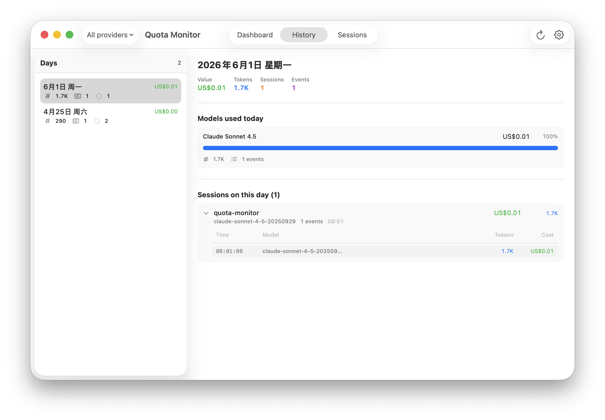

左侧是有使用记录的日期列表，每一行显示当天费用、tokens、会话数和事件数。点击某一天后，右侧会显示：

- 当天总费用、tokens、会话数和事件数。
- `Models used today`：当天各模型费用占比。
- `Sessions on this day`：当天会话列表。

点击会话行左侧箭头会展开事件时间线。展开后可以看到每条事件的时间、模型、tokens 和费用。这个页面适合回答“某一天为什么用量变高”。

## Sessions

Sessions 用来按会话查找、排序和查看明细。

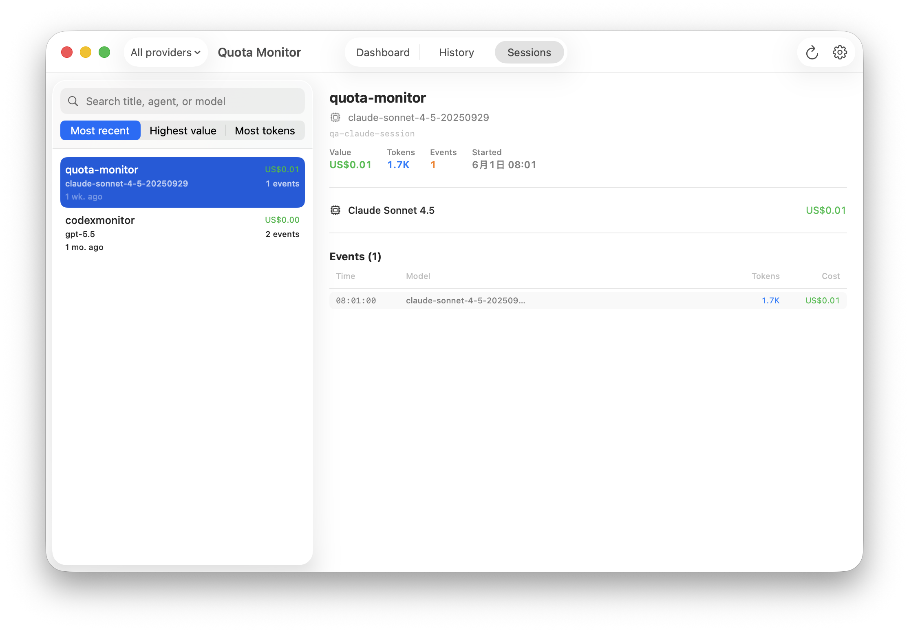

左侧控制区：

- 搜索框：输入标题、agent 或模型名进行过滤。输入后会出现清空按钮，点击可恢复完整列表。
- `Most recent`：按最近更新时间排序。
- `Highest value`：按费用估算从高到低排序。
- `Most tokens`：按 token 数从高到低排序。

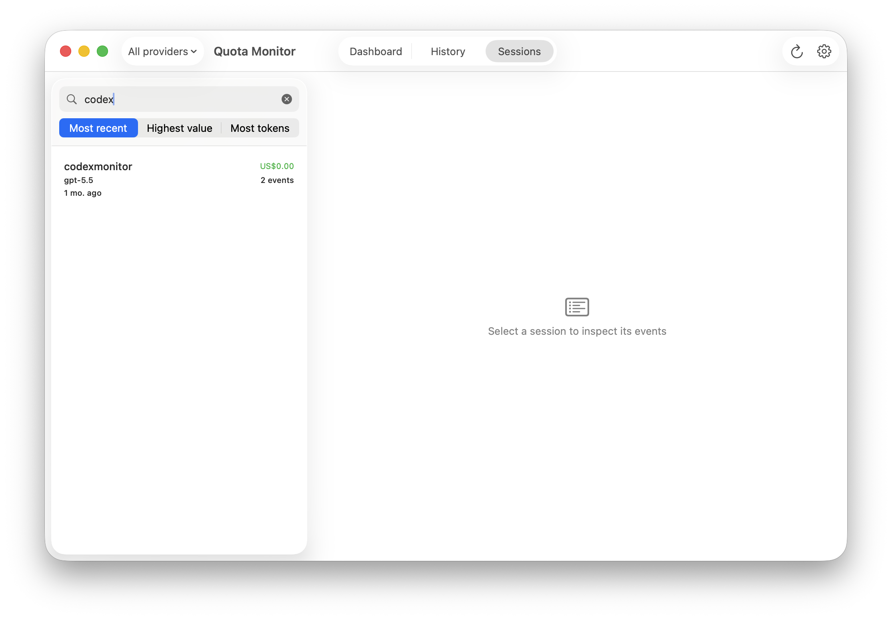

点击左侧任意会话后，右侧显示：

- 会话标题、模型、会话 ID。
- 总费用、tokens、事件数和开始时间。
- 模型费用明细。
- 事件列表，包括时间、模型、tokens 和费用。

在事件行上悬停会显示更细的 token 明细，例如输入、缓存输入、输出和推理 tokens。若模型是推断出来的，界面会用提示说明费用是估算值。

## Settings

Settings 分为 `General` 和 `Advanced` 两个页签。

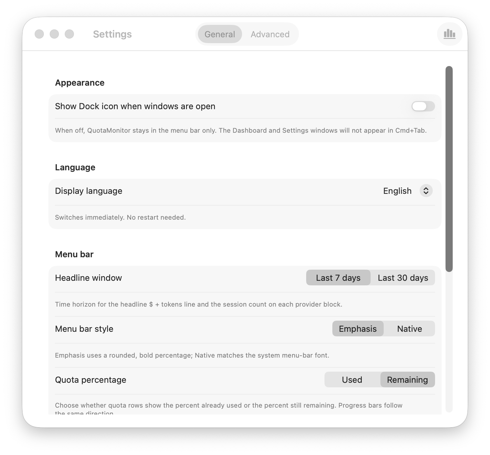

General 适合普通用户日常调整：

- `Show Dock icon when windows are open`：开启后 Dashboard 和 Settings 会出现在 Dock 与 Cmd+Tab；关闭后 App 更像纯菜单栏工具。
- `Display language`：切换界面语言，立即生效。
- `Headline window`：选择菜单栏和 Dashboard 顶部统计使用最近 7 天还是 30 天。
- `Menu bar style`：选择菜单栏读数的显示风格。
- `Quota percentage`：选择配额行显示“已使用”还是“剩余”。
- `Show in menu bar`：选择哪些已追踪工具出现在菜单栏读数中。
- `Can't find the menu-bar icon?`：打开找回菜单栏图标的帮助。
- `Tracked tools`：开启或关闭 Codex、Claude Code 的追踪。关闭某个工具后，对应后台轮询和页面卡片会停止显示。至少要保留一个工具。
- `Share anonymous version statistics`：仅在你明确开启后，每个 UTC 日最多形成一条按当天去重的活跃安装记录；网络失败时可能重试发送同样的应用版本、品牌和分发渠道等六个字段。它帮助维护者估算仍在活跃使用的安装版本，不会发送账号、用量历史、路径、设备 ID 或稳定标识；关闭后会停止后续请求并清理当天的本地上报状态。

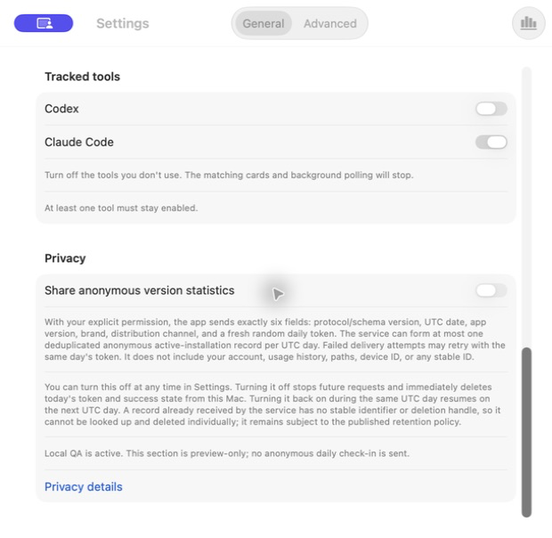

截图使用隔离 Local QA 预览，因此开关被禁用并明确标注不会发送数据。正式 Developer ID 版本中可以自行开启或关闭；点击 `Privacy details` 可查看完整的中英双语隐私说明。

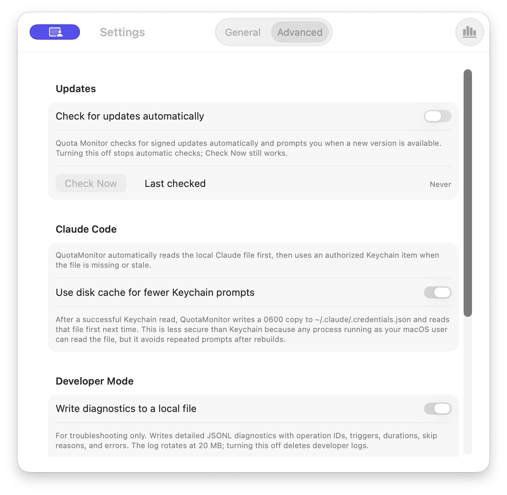

Advanced 适合需要调整更新、轮询或诊断选项的用户：

- `Update`：仅在有尚未处理的新版本时显示，点击后继续更新流程。
- `Check for updates automatically`：控制是否自动检查新版本；关闭后仍可使用 `Check Now` 手动检查。
- `Check Now`：立即检查更新。检查更新会访问更新源。
- `Interval`：调整从本地 Codex 获取限额信息的间隔。
- Claude 凭据恢复提示：只有此前保存的“仅文件”模式阻止自动凭据刷新时才会显示恢复按钮。
- `Cache Claude credentials to disk`：将 Keychain 中读到的 Claude 凭据缓存到文件，减少重复提示；开启前应理解安全影响。
- `Developer Mode`：写入本地诊断日志，主要用于排查问题。
- `Reveal Log File`：在 Finder 中打开诊断日志位置。
- `Uninstall Quota Monitor...`：删除 Quota Monitor 的数据库、设置和缓存，并把 App 移到废纸篓。`~/.codex` 和 `~/.claude` 不会被删除。点击后会出现确认弹窗。

数据库位置、CSV 导出和价格目录管理属于内部维护能力，不再显示在 Advanced 设置中；这次界面精简不会改变应用日常的数据读取、汇总和计价行为。

## 菜单栏图标帮助

当 macOS 菜单栏空间不足、图标被刘海或菜单栏管理工具隐藏时，Quota Monitor 会提供帮助窗口。

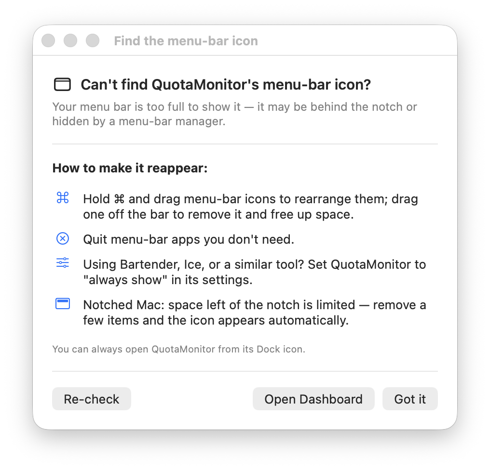

按钮行为：

- `Re-check`：重新检查菜单栏图标是否可见。
- `Open Dashboard`：打开 Dashboard。
- `Got it`：关闭帮助窗口。

帮助窗口会建议你按住 Command 拖动菜单栏图标、退出不需要的菜单栏 App，或在 Bartender、Ice 等工具里把 Quota Monitor 设为始终显示。

## 更新窗口

如果有新版本可用，Quota Monitor 会显示更新窗口。窗口会展示新版本号、当前版本号和发布说明。

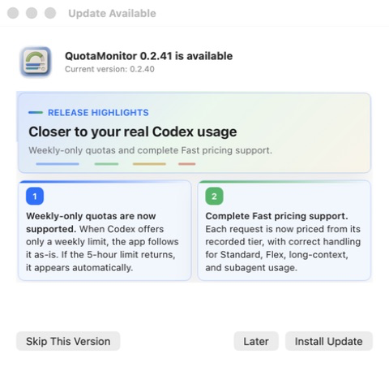

常见按钮：

- `Skip`：跳过这个版本。
- `Later`：暂时关闭提醒，下次再处理。
- `Install`：下载并安装更新。
- `Install & Relaunch`：更新准备好后安装并重启 App。
- `Cancel`：下载中取消。
- `Done`：关闭错误或完成提示。

选择 `Later` 或直接关闭“发现更新”窗口后，更新不会从应用里消失：再次打开菜单栏弹窗、Dashboard 或 Advanced 设置时，蓝色 `Update` 按钮会继续显示，并且跨重启保留。macOS 菜单栏文字保持原样，同一版本的后续自动检查也不会反复弹窗；点击 `Update` 或 `Check Now` 可以随时重新打开更新窗口。选择 `Skip This Version` 只会跳过当前版本；以后发现新版本时仍会重新提示。

## 持续更新规则

后续更新本文时，请保留旧内容，并按以下方式追加：

1. 用当前 commit 启动真实 App 或隔离 QA App。
2. 对新增或变更的页面、按钮、弹窗补截图，放入 `docs/assets/product-manual/<commit>/`。
3. 在对应页面小节里更新普通用户能看懂的说明。
4. 在下方更新记录追加一条记录，说明本次新增或变化的用户可见能力。
5. 不把实现细节写进用户说明；实现、命令和 QA 证据只放在维护记录里。

## 更新记录

### 2026-07-24 · Unreleased · c24c009

从最小化状态恢复 Dashboard 时会刷新最新摘要和图表；Advanced 设置中的自动更新说明不再描述固定检查频率。

维护记录：

- 在 `c24c009` 上运行 `CONFIG=release ./qa/prepare-computer-use-fixture-smoke.sh`，精确 App target 为当前 worktree 的 `.build/QuotaMonitor.app`。
- QA artifact 为 `.build/qa-artifacts/20260723T170505Z-computer-use-fixture-smoke`；fixture、隔离 HOME、独立 UserDefaults 和禁用 live external sources 的边界均有效。
- 使用 Computer Use 验证 Advanced 设置的新英文说明完整显示、没有裁切，并实际执行 Dashboard 最小化与恢复；开发日志记录到一次成功的 `window-restore` 刷新。
- 新截图位于 `docs/assets/product-manual/c24c009/settings-advanced.png`，来自该准确构建的 Settings 窗口。

### 2026-07-17 · 0.2.42（待验收） · b87bc89

Advanced 设置不再显示数据库位置、CSV 导出和价格目录管理入口；底层数据读取、汇总和计价行为保持不变。

维护记录：

- 使用 `./qa/prepare-computer-use-real-data.sh` 启动隔离 QA App；QA artifact 为 `.build/qa-artifacts/20260717T153359Z-computer-use-real-data`，精确 App target 为当前 worktree 的 `.build/QuotaMonitor.app`。
- 使用 Computer Use 检查 Advanced 设置的完整可访问性树，确认只显示更新、Codex CLI、Claude Code、开发者模式和卸载区块。
- `./qa/check-artifacts.sh .build/qa-artifacts/20260717T153359Z-computer-use-real-data` 通过，保护报告确认真实数据库在 QA 前后大小与 SHA-256 均未变化。
- 新截图位于 `docs/assets/product-manual/b87bc89/settings-advanced.png`，仅包含隔离 QA App 的 Advanced 设置窗口。
- 文档更新后再次运行 `./qa/run-static.sh`，159 个工具测试和 678 个 Swift 测试通过。

### 2026-07-16 · 0.2.41（待验收） · 4ede5cd

更新入口改为应用内蓝色 `Update` 文字按钮；macOS 原生菜单栏标题不再显示更新箭头或强调色，选择 `Later` 后也不再为同一版本安排定时提醒。

维护记录：

- 使用 `./qa/prepare-computer-use-real-data.sh` 启动隔离 QA App；QA artifact 为 `.build/qa-artifacts/20260716T144846Z-computer-use-real-data`，精确 App target 为当前 worktree 的 `.build/QuotaMonitor.app`。
- 在隔离 defaults 中注入 `99.0 QA` 待更新状态，验证跨重启保留和 `Later` 状态；Local QA 禁用 Sparkle 网络检查、下载和安装，未复制凭据。
- `./qa/check-artifacts.sh .build/qa-artifacts/20260716T144846Z-computer-use-real-data` 通过，保护报告确认真实数据库在 QA 前后大小与 SHA-256 均未变化。
- 使用 Computer Use 验证 Dashboard 工具栏、Advanced 设置和菜单栏弹窗中的蓝色 `Update`；原生菜单栏标题仍只有额度信息。
- 弹窗截图位于 `docs/assets/product-manual/4ede5cd/update-popover.png`，截图仅包含隔离 QA App 区域。
- 完成文档后运行 `./qa/run-static.sh` 作为最终静态与测试门禁。

### 2026-07-16 · 0.2.41 · 87c757d

更新提醒现在会跨重启保留；该记录最初采用常驻菜单栏标记和定时强调，随后在同日的待验收改动中改为仅在打开应用界面后显示蓝色 `Update` 按钮。General 设置新增可选的匿名版本统计和完整隐私说明。

维护记录：

- 使用 `./qa/prepare-computer-use-fixture-smoke.sh` 启动隔离 QA App；QA artifact 为 `.build/qa-artifacts/20260716T034245Z-computer-use-fixture-smoke`，精确 App target 为当前 worktree 的 `.build/QuotaMonitor.app`。
- `./qa/check-artifacts.sh .build/qa-artifacts/20260716T034245Z-computer-use-fixture-smoke` 通过；夹具数据库包含 Codex 与 Claude 数据，边界清单明确禁止 live external sources。
- 使用 Computer Use 验证 General 隐私区、Advanced 更新控件、更新窗口、Dashboard 和菜单栏相关窗口；Local QA 下匿名版本开关、自动更新检查与 `Check Now` 均正确禁用。
- QA 进程没有网络 socket，Developer Mode 日志中没有匿名上报或禁用的外部数据源事件。
- 文档截图位于 `docs/assets/product-manual/87c757d/`；更新预览使用本地 HTML，不访问更新源或下载安装包。
- 完成文档后运行 `./qa/run-static.sh` 作为最终静态与测试门禁。

### 2026-06-09 · 0.2.31 · 508accc

建立第一版产品说明。覆盖首次设置、菜单栏弹窗、Dashboard、History、Sessions、Settings、菜单栏帮助、更新窗口和卸载路径。

维护记录：

- 运行 `./qa/run-static.sh`，静态检查、release note 校验、Swift 构建和 269 个 Swift 测试通过。
- 运行当时的 `./qa/prepare-computer-use-fixture.sh` 启动隔离 QA App；该入口现在仅作为兼容 wrapper，新固定夹具入口是 `./qa/prepare-computer-use-fixture-smoke.sh`。
- QA App target：`/Volumes/SamsungDisk/Code/quota-monitor/.build/QuotaMonitor.app`。
- QA artifact：`.build/qa-artifacts/20260609T105643Z-computer-use-fixture`。
- `./qa/check-artifacts.sh .build/qa-artifacts/20260609T105643Z-computer-use-fixture` 通过。
- 使用 Computer Use 和窗口级截图验证主要页面、菜单、搜索、排序、展开行和设置页。
