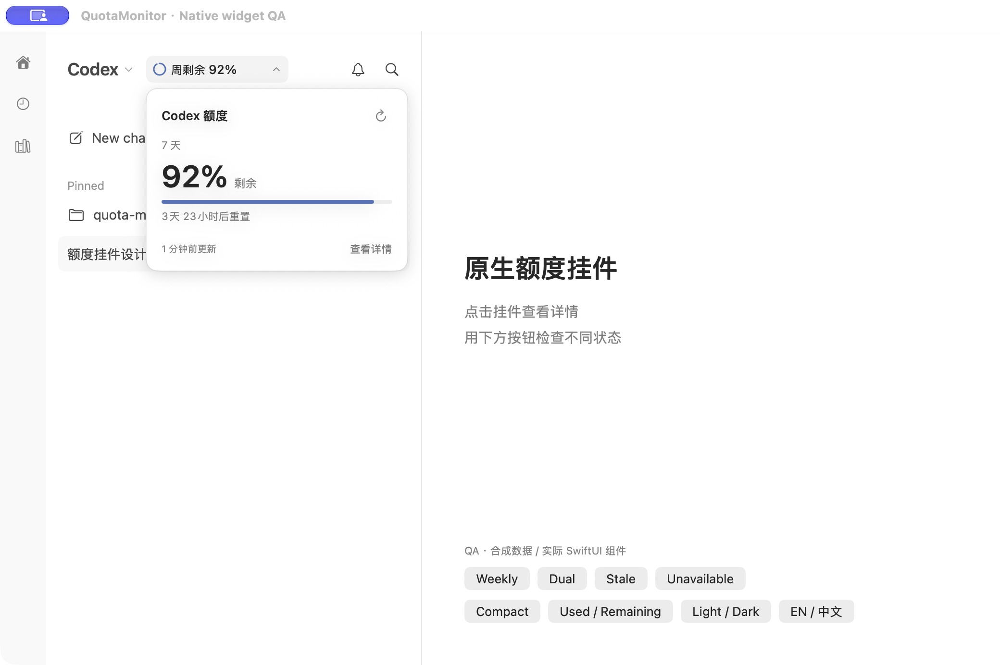
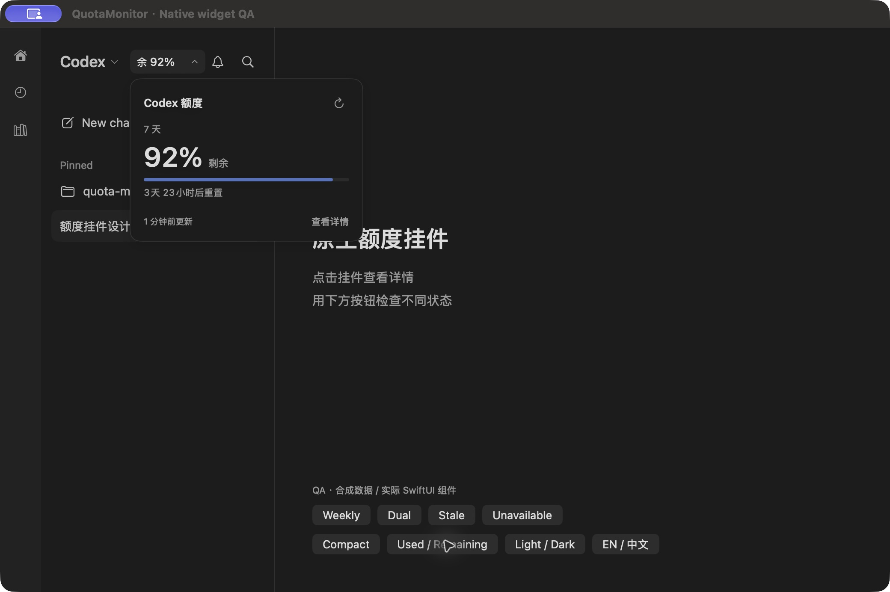
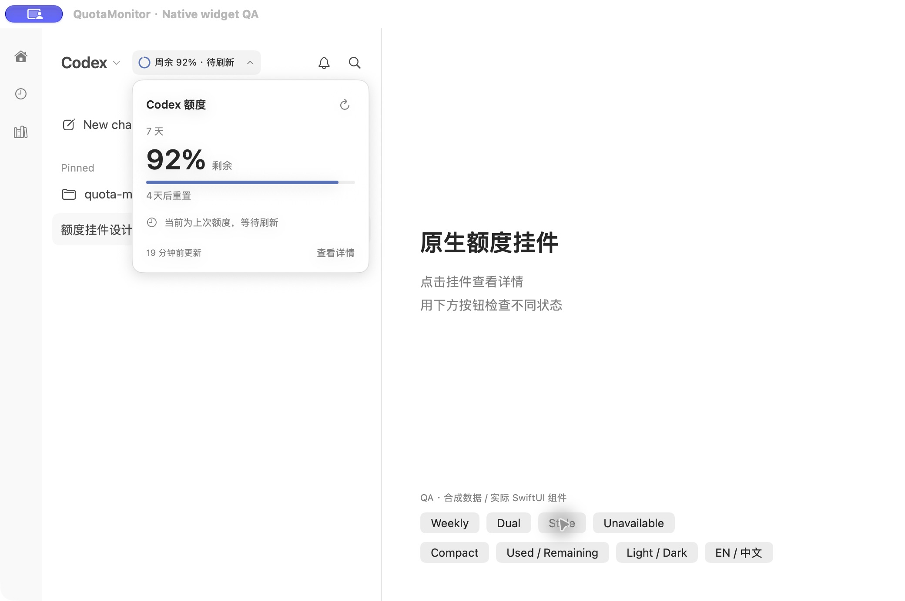
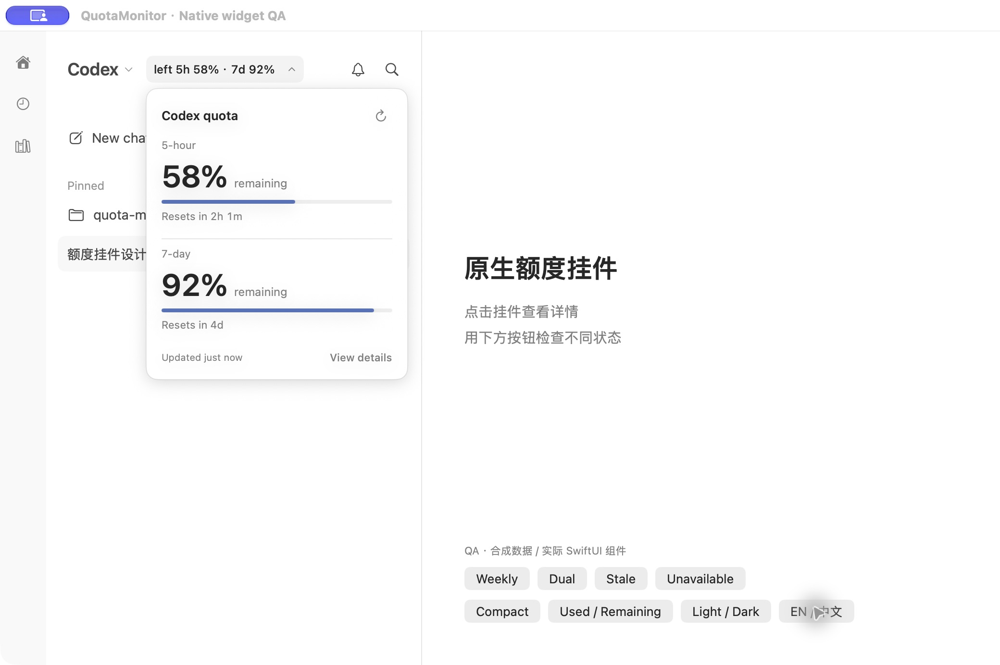
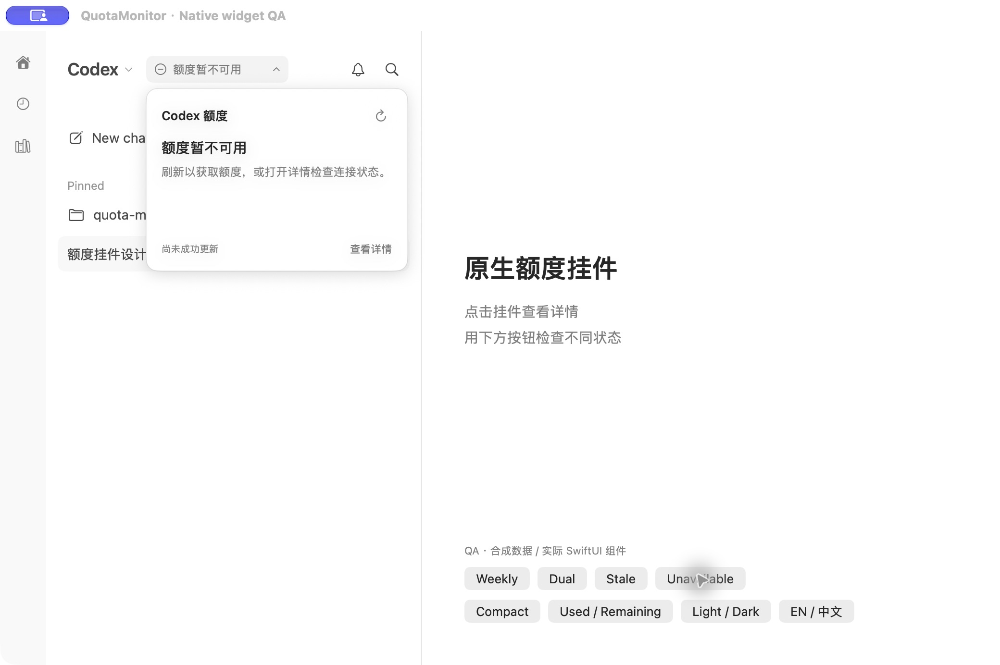
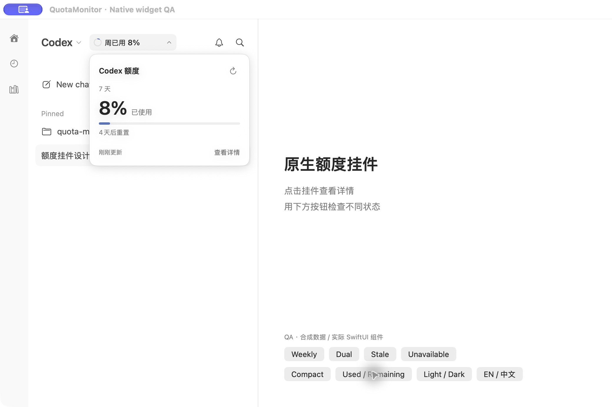

# Sidebar quota widget — native visual evidence

Captured from the running macOS build of `125a543a7713d7513d33117ba1e8363370bd959a` (app version 1.0.8). The following documentation-only commit adds these images without changing app code. Hashes and capture metadata are in [capture.json](capture.json).

These are Computer Use screenshots of the shipping SwiftUI summary and details components rendered in an isolated native QA gallery, using synthetic quota. The surrounding sidebar is a fixture. The images are not generated mockups or captures of the real Codex host.

## Reproduce

```sh
QM_QA_LANGUAGE=zh-Hans ./qa/prepare-sidebar-widget-preview.sh
```

This builds the app, copies it into a uniquely identified QA bundle, and launches with an isolated home, defaults suite, and database. It leaves existing app processes and the installed application untouched. Use the gallery controls for weekly, dual-window, stale, unavailable, compact, used/remaining, locale, and appearance states. Normal launches do not enable the gallery.

## Verification

- `swift test --disable-keychain --filter 'CodexQuotaOverlayTests|RateLimitPollerTests'`: 35 tests passed.
- `./qa/run-static.sh`: 1,023 Swift tests in 117 suites, 191 Python tests, shell helpers, release notes, and whitespace gate passed.
- Native gallery: inspected light/dark, weekly/dual, normal/compact, stale/unavailable, English/Chinese, and used/remaining. Verified click toggle and Escape dismissal in the gallery. Corrected clipping in the stale label and English dual-window readout after inspecting the running build.
- Source regression tests cover safe header selection, insufficient space, display conversion, normalized manual placement, drag policy, click-away policy, reset credits, stale/failed refresh, and missing windows.

**UNVERIFIED:** live placement in the external Codex accessibility tree; real host focus, window switching, sidebar collapse, and NSPanel long-press/drag behavior. Computer Use denied access to the Codex app. The gallery validates component rendering and its own interaction wiring; it does not substitute for those host checks. Existing header discovery cadence remains 10 seconds when anchored. Automatic placement now requires an accessible recognized header and enough free space; saved manual positions remain supported.

## Captured states

| Weekly, light | Compact, dark |
| --- | --- |
|  |  |

| Stale data | English, both windows |
| --- | --- |
|  |  |

| No quota available | Used mode |
| --- | --- |
|  |  |
