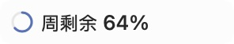

# Native widget discovery and popup verification

Candidate source: `5e53e2a`, tested on 2026-09-28 (Asia/Shanghai).

The installed beta.2 still showed “no safe header space” despite granted Accessibility permission. A matching mode-selector label alone did not establish real-host recovery. The reader now requests the application role, searches deeper wrappers, prunes off-header content, and reports distinct discovery failures.

Window tracking now binds to the Accessibility main standard window rather than the first large CG window. Window geometry must match instead of merely overlap. Temporary AX misses retain the last measured slot; changing the document or its size invalidates it. Translating the same document preserves its relative slot.

## Actual Codex host

The locally Developer ID signed candidate used the same designated code requirement as the installed app, with an isolated QA HOME/defaults suite, disabled external data sources/keychain access, and synthetic quota. QuotaMonitor's own diagnostics reported a matched main window and a discovered header (97 visited elements, 9 candidate controls, 1 web area). Computer Use then observed the actual native quota panel. No protected Codex UI tree or screenshot was captured.

The candidate was relaunched with a saved manual position `[0.18, 0.02]`. Computer Use opened the widget's context menu and selected Restore automatic position. The persisted manual key was removed and a fresh accessibility observation confirmed that the same widget remained visible. The Return command reported a timeout; the subsequent UI and preference reads established that the action completed.

## Native popup regression

An owned, eligible layer-zero 600-by-360 preview window was opened above a real main window. It became the first eligible CG window, reproducing the old selector's bad choice. The corrected selector retained the main window both with automatic placement (`[587,897,148,28]`) and with a saved manual position (`[608,315,148,28]`). Repeated open/close operations did not change the saved position or widget frame. This fixture supplies its own AppKit main-window identity; the real-host check above separately exercises the production Accessibility adapter.

Focused checks: 52 tests across four suites. Full static gate: 1,051 Swift tests across 120 suites plus 191 Python tests. Regression coverage includes cold trees, deep wrappers, budgets, cycles, identity collisions, missing bounds, permission/cancellation, overlapping popup frames, ambiguous identities, second document windows, off-screen documents, and position preservation.

Physical one-second pointer dragging and the user's exact Codex preview open/close gesture remain **UNVERIFIED** by automation. A native fixture title-bar drag did not move its window. The existing expanded panel and its content are unchanged.
